# Hybrid Active Directory + Microsoft Entra ID Lab

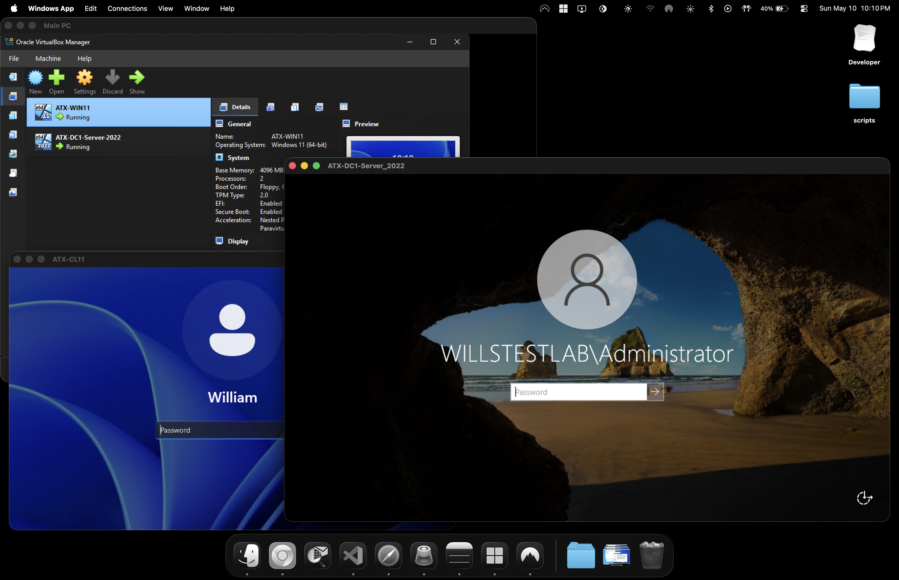

Enterprise-style hybrid identity lab built to simulate a real-world on-prem + cloud identity environment using:

- Windows Server 2022
- Active Directory Domain Services (AD DS)
- Microsoft Entra Connect Sync
- Microsoft Entra ID (Azure AD)
- Windows 11 Pro
- VirtualBox
- Remote administration from macOS using Microsoft Windows App (RDP)

This project extends my existing systems administration home lab by introducing hybrid identity synchronization between on-prem Active Directory and Microsoft Entra ID.

The environment was designed to replicate how enterprise organizations synchronize on-prem identities to the cloud while maintaining centralized authentication, scoped synchronization, and hybrid identity management.

---

# Project Overview

This lab was built to simulate a hybrid enterprise infrastructure where:

- On-prem Active Directory manages users and authentication
- Windows endpoints are domain joined
- Microsoft Entra Connect synchronizes identities to Azure
- Specific Organizational Units (OUs) are scoped for synchronization
- Password Hash Synchronization (PHS) is enabled
- Seamless Single Sign-On (SSO) is configured
- Infrastructure is remotely managed from macOS

---

# Environment Overview

| Component | Details |
|---|---|
| Hypervisor | VirtualBox |
| Domain Controller | Windows Server 2022 |
| Client Device | Windows 11 Pro |
| Identity Platform | Microsoft Entra ID |
| Sync Tool | Microsoft Entra Connect Sync |
| Domain Name | willstestlab.com |
| Remote Access | Microsoft Windows App (RDP) |
| Host Device | Windows Desktop |
| Management Device | MacBook Pro |

---

# Network Topology

```text
+---------------------------+
| Microsoft Entra ID        |
| (Azure AD Cloud Identity) |
+------------+--------------+
             ^
             |
      Entra Connect Sync
             |
+------------+--------------+
| ATX-DC1                   |
| Windows Server 2022       |
| AD DS / DNS / Entra Sync  |
+------------+--------------+
             |
     Domain Join / DNS
             |
+------------+--------------+
| ATX-CL11                  |
| Windows 11 Pro Client     |
+---------------------------+
```

---

# Project Goals

- Deploy Active Directory Domain Services
- Configure DNS and domain services
- Domain join Windows 11 endpoints
- Configure Microsoft Entra Connect Sync
- Synchronize selected OUs to Microsoft Entra ID
- Validate hybrid identity synchronization
- Configure Password Hash Sync
- Configure Seamless SSO
- Simulate enterprise hybrid identity administration
- Remotely manage infrastructure from macOS

---

# Virtual Machines

## Domain Controller

| Setting | Value |
|---|---|
| Hostname | ATX-DC1 |
| Operating System | Windows Server 2022 |
| Roles | AD DS, DNS, Entra Connect |
| IP Address | 192.168.x.x |
| Domain | willstestlab.com |

---

## Windows Client

| Setting | Value |
|---|---|
| Hostname | ATX-CL11 |
| Operating System | Windows 11 Pro |
| Domain Joined | Yes |
| IP Address | 192.168.x.x |

---

# Features Implemented

## Active Directory Domain Services

- Installed and configured:
  - Active Directory Domain Services (AD DS)
  - DNS
- Created custom Active Directory domain:

```text
willstestlab.com
```

- Created Organizational Units (OUs)
- Created test users and groups
- Configured domain authentication and DNS resolution

---

## Domain Joined Endpoints

Successfully domain joined Windows 11 client:

```text
ATX-CL11
```

Validated:

- Domain authentication
- DNS communication
- Trust relationship
- Network connectivity
- Remote access functionality

---

## Microsoft Entra Connect Sync

Configured Microsoft Entra Connect Sync to enable hybrid identity synchronization between on-prem Active Directory and Microsoft Entra ID.

Implemented:

- Password Hash Synchronization (PHS)
- Seamless Single Sign-On (SSO)
- OU-based synchronization filtering
- Source Anchor configuration
- Hybrid identity synchronization

Validated successful synchronization of on-prem identities into Microsoft Entra ID.

---

## OU-Based Synchronization

Configured scoped synchronization to synchronize only selected Organizational Units (OUs) into Microsoft Entra ID.

Example synchronized OU:

```text
Corp Entra Connect Sync
```

This replicated enterprise-style synchronization scoping and identity management practices.

---

## Remote Administration

Managed the entire infrastructure remotely from macOS using:

- Microsoft Windows App (RDP)

This simulated remote systems administration workflows commonly used in enterprise environments.

---

# PowerShell Administration

## Force Delta Synchronization

```powershell
Start-ADSyncSyncCycle -PolicyType Delta
```

---

## Remote Delta Synchronization

```powershell
Invoke-Command -ComputerName ATX-DC1 -ScriptBlock {
    Start-ADSyncSyncCycle -PolicyType Delta
}
```

---

## Verify ADSync Service

```powershell
Get-Service ADSync
```

---

# Validation Performed

- Verified successful domain join
- Verified DNS resolution
- Verified Entra Connect synchronization
- Verified Azure user object creation
- Verified OU filtering functionality
- Verified Password Hash Synchronization
- Verified Seamless SSO configuration
- Verified remote administration connectivity
- Verified hybrid identity synchronization

---

# Technologies Used

- Windows Server 2022
- Windows 11 Pro
- Microsoft Entra ID
- Microsoft Entra Connect Sync
- Active Directory Domain Services
- DNS
- PowerShell
- VirtualBox (Can also be completed using VM Ware)
- Remote Desktop (RDP)

---

# Key Skills Demonstrated

- Active Directory Administration
- Hybrid Identity Architecture
- Microsoft Entra ID Administration
- Microsoft Entra Connect Sync
- OU Filtering
- PowerShell Administration
- Windows Server Administration
- DNS Configuration
- Virtualization
- Remote Systems Administration
- Enterprise Identity Management
- Endpoint Management
- Infrastructure Troubleshooting

---

# Screenshots

## Lab Infrastructure Overview

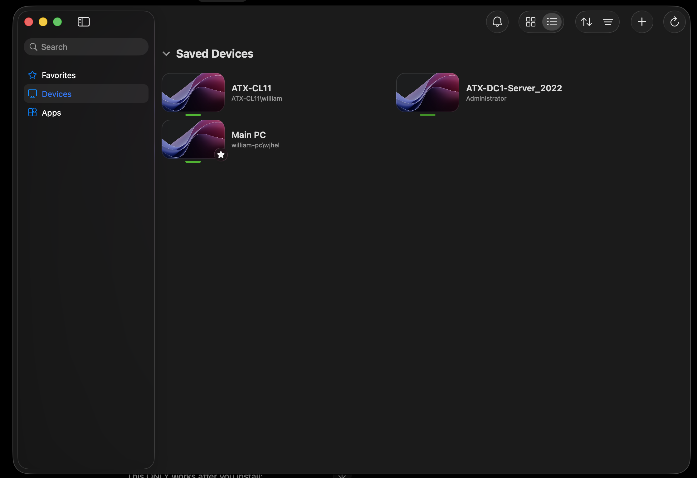

---

## Microsoft Entra ID Synced Users

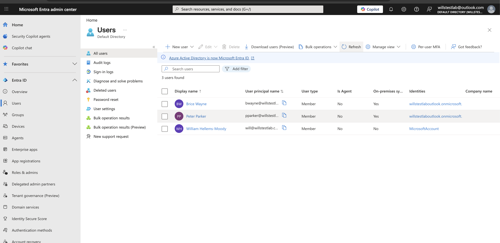

---

## Successful Delta Sync via PowerShell

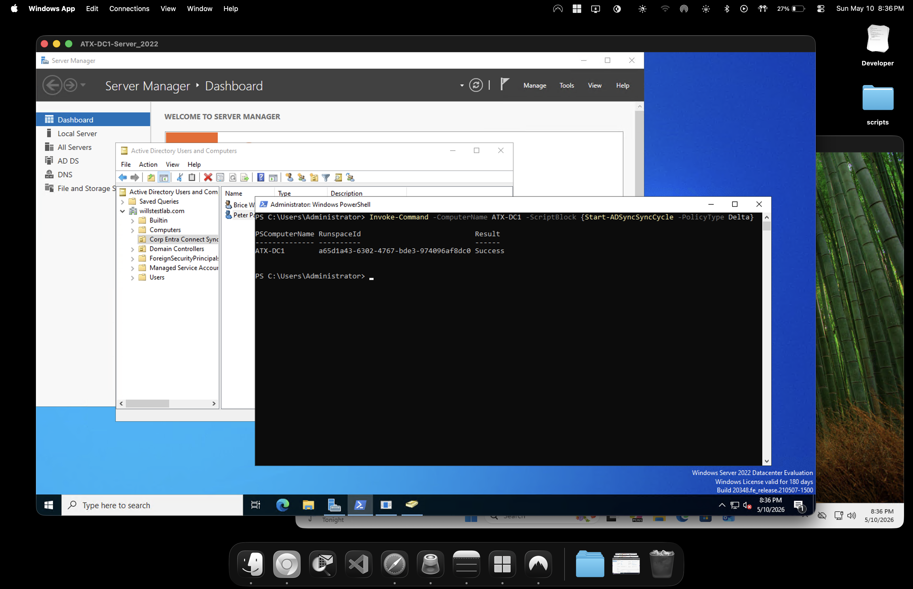

---

## Entra Connect Configuration Complete

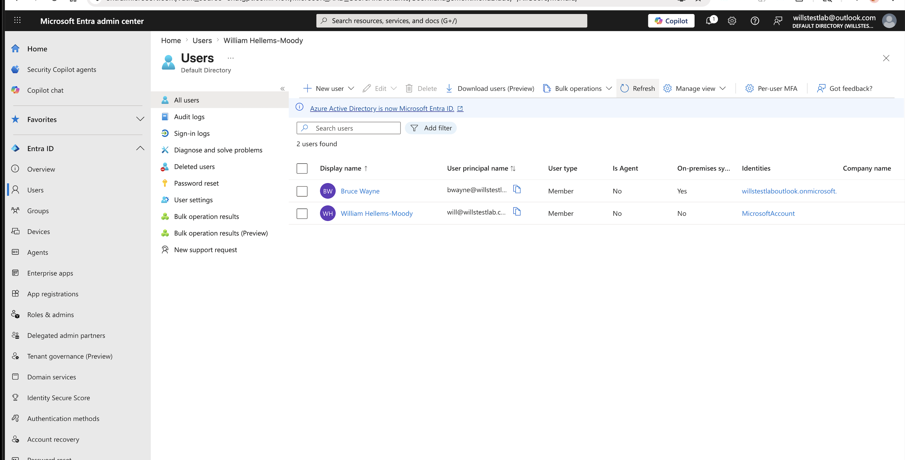

---

## Successful Domain Join

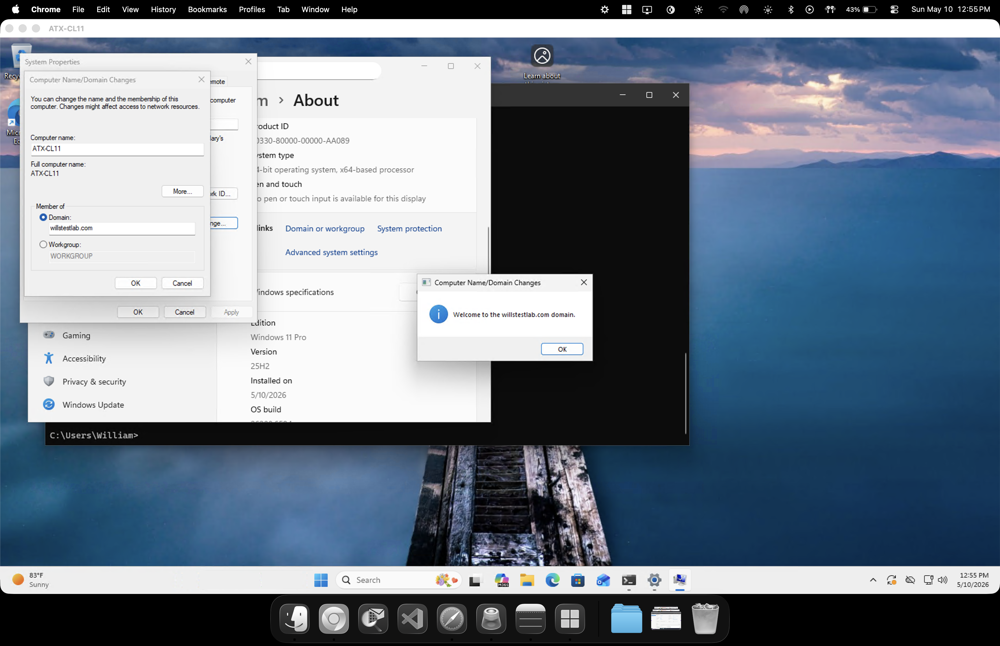

---

## DNS Connectivity Validation (Performed)

---

## Entra Connect Directory Connection


---

## Custom Domain Configuration & Verification

Configured and verified a custom domain inside Microsoft Entra ID to simulate a real-world enterprise hybrid identity environment.

Custom domain configured:

```text
willstestlab.com
```

Tasks completed:

- Added custom domain to Microsoft Entra ID
- Verified domain ownership
- Configured UPN suffix alignment
- Linked on-prem Active Directory identities with Microsoft Entra ID
- Validated hybrid sign-in configuration

This allowed synchronized on-prem user accounts to authenticate using the organizational domain instead of the default Microsoft `onmicrosoft.com` domain.

### Domain Verification

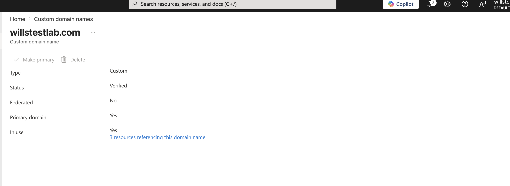

---

### Microsoft Entra Sign-In Configuration

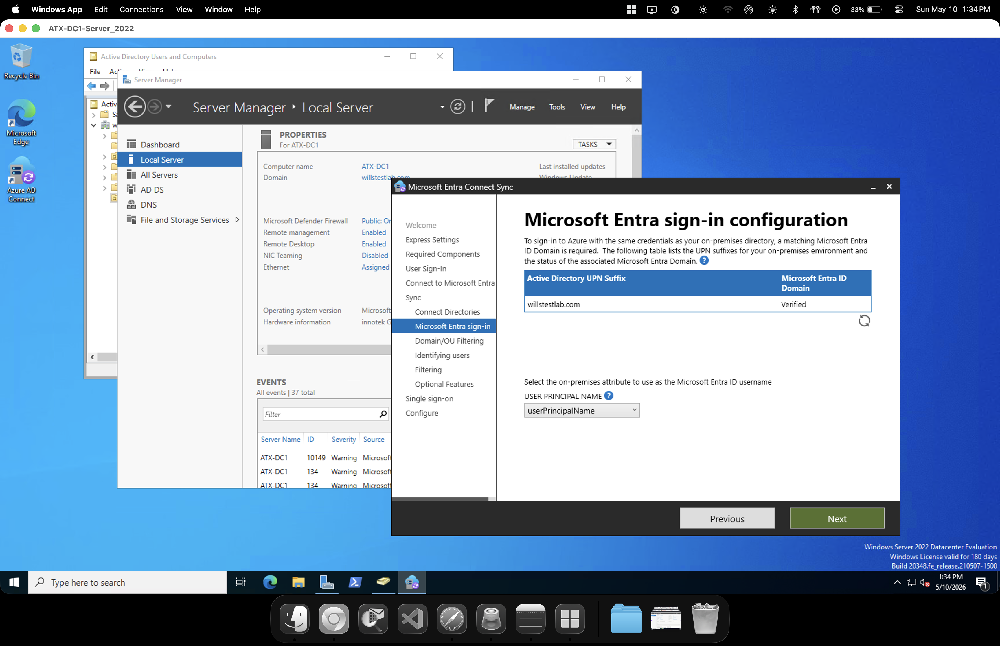

---

## OU Filtering Configuration

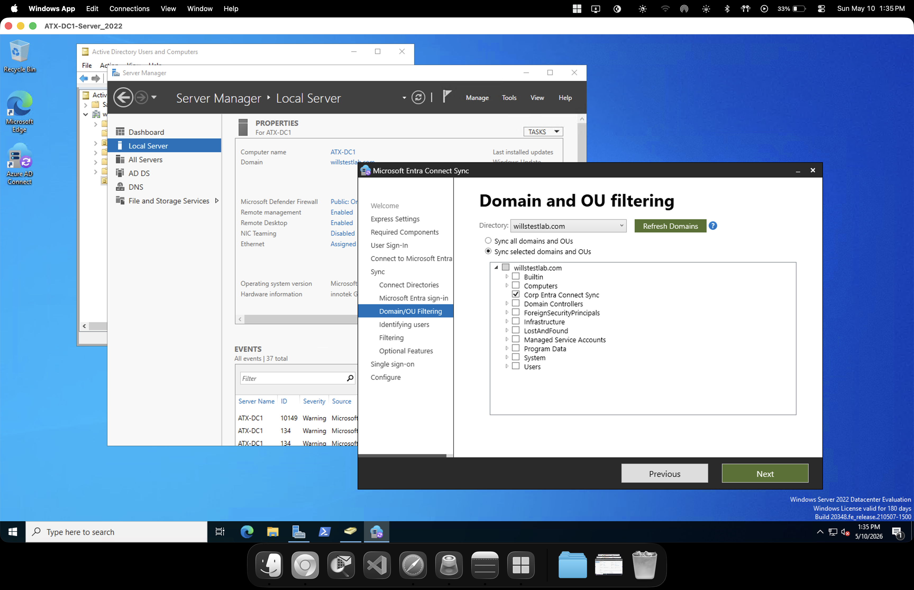

---

## Group Writeback Configuration

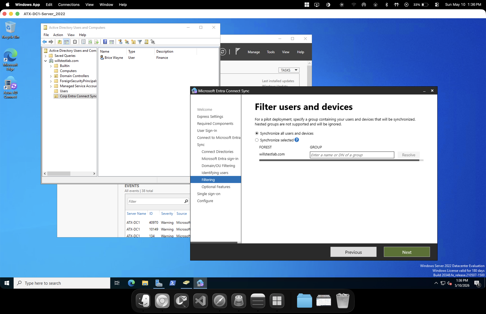

---

## Complete Microsoft Entra Connect Configuration

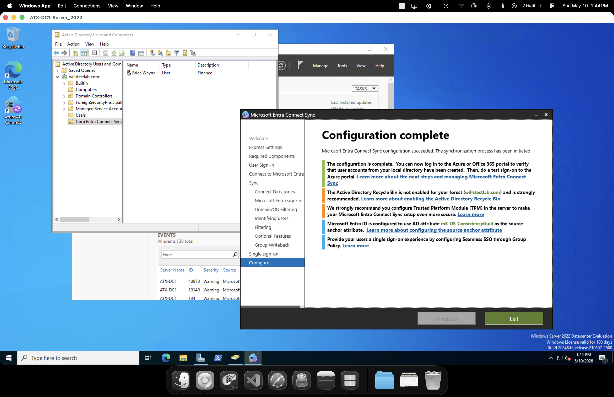

---

# Future Improvements

- Enterprise Application Setup
- Configure Conditional Access policies & MFA
- Deploy Group Policy Objects (GPOs)
- Add additional Windows clients
- Configure RBAC administration
- Configure Enterprise Applications + SSO

---

# Author

William Hellems-Moody
